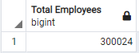
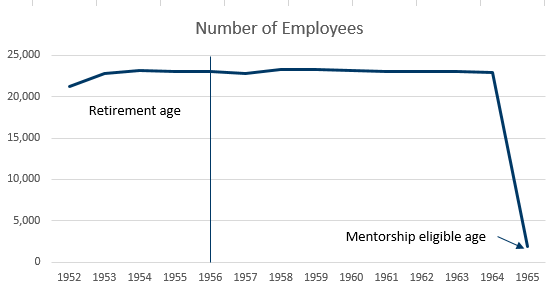

# Overview of the Pewlett-Hackard-Analysis. 

### A manager at this company has requested some information on retiring employees as well as employess who are eligible for a mentorship program. Eligibility in both of these are base on the birth date of the employees. The PostGreSQL database created contains tables with infomration on employees, managers, department, employees department, titles and salaries. The analyses will be used to help the company prepare for the large number of retiring employees. Other tables and data will be explored to address how the company may want to deal with the "silver tsunami" of lots of retirement eligible employees.

## Deliverable 1: The Number of Retiring Employees by Title

### The following code selects info from joined employees and titles tables with DOB in 1952-55 and creates a new table - retirement_titles
``` SQL
-- Create a Retirement Titles table for employees
-- Eligibility for retirement based on DOB in 1952-55
SELECT e.emp_no,
    e.first_name,
    e.last_name,
    t.title,
    t.from_date,
    t.to_date
INTO retirement_titles
FROM employees as e
INNER JOIN titles as t ON (e.emp_no = t.emp_no)
WHERE e.birth_date BETWEEN '1952-01-01' AND '1955-12-31'
ORDER by e.emp_no ;
```

### The resulting table is a list of all employees with DOB in 1952 and their job titles (Multiple titles per employee)
 

### The following code selects info from the retirement_titles tables and selects the most recent title along with first and last name and saves it into a new table -- unique_tables

```SQL
-- Use Distinct with Orderby to remove duplicate rows
--create a Unique Titles table that contains the employee number, 
--first and last name, and most recent title
SELECT DISTINCT ON (rt.emp_no) rt.emp_no,
    rt.first_name,
    rt.last_name,
    rt.title
INTO unique_titles
FROM retirement_titles rt
ORDER BY rt.emp_no, rt.to_date DESC;
```

### The resulting table is a list of all retirement eligible employees and their most recent job title
 

### The following code selects info from the unique_titles tables and counts the number of employees with each title into a new table - retiring_titles

```SQL
--create a Retiring Titles table that contains the number of titles 
--filled by employees who are retiring
SELECT DISTINCT COUNT(title), title
INTO retiring_titles
FROM unique_titles
GROUP BY title
ORDER BY COUNT(title) DESC ;
```
### The resulting table is a list of all job titles with the total number of retiring employees within each title
 

## Deliverable 2: The Employees Eligible for the Mentorship Program

### The following code selects info from the joined employees, dept_emp and titles tables. The mentorship eligibility is based on DOB in 1965 and employment to_date = '9999-01-01' to signify current employee. The results are saved in a new table -- mentorship_eligibilty

```SQL
-- create a Mentorship Eligibility table for current employees with DOB in 1965
SELECT DISTINCT ON (e.emp_no) 
	e.emp_no,
    e.first_name,
    e.last_name,
	e.birth_date,
	d.from_date,
	d.to_date,
    t.title
INTO mentorship_eligibilty
FROM employees as e
INNER JOIN dept_emp as d ON (e.emp_no=d.emp_no)
INNER JOIN titles as t ON (e.emp_no = t.emp_no)
WHERE d.to_date = ('9999-01-01')
AND e.birth_date BETWEEN '1965-01-01' AND '1965-12-31'
ORDER by e.emp_no, d.to_date DESC;
```

### The resulting table is a list of all the mentorship eligible employees
 

## Results

-   A large percentage of Total Employees are of retirement age (90,398/300,024 = 30.1%)
    - Total Employees = 300,024
    ```SQL 
    select count(emp_no) as "Total Employees" from employees 
    ```
    

    - Total Retirement Eligible Employees = 90,398

     

-   More than 2/3 of the Retirement Eligible Employees are in Senior or Leadership positions (68.8%)
    - Senior Engineer-29,414 + Senior Staff-28,254 + Technique Leader-4,502 + Manager-2 = 62,172
        - 62,172/90,398 = 68.8%
-   There are only 1,549 Employees in the mentorship eligible category; less than 1% of the total employees (1,549/300,024 = 0.52%)
    ```SQL
    select count(*) as "Mentees" from mentorship_eligibilty ;
    ```
     

-   Only 815 on the mentees are in Senior or Leadership positions
    - Senior Engineer-169 + Senior Staff-569 + Technique Leader-77= 815
    ```SQL
    select title, count(emp_no) as "Total Mentorship Employees"
    from mentorship_eligibilty
    group by title
    order by count(emp_no) desc ;
    ```
     

## Summary and Further Analyses

1. How many roles will need to be filled as the "silver tsunami" begins to make an impact?
- New code to look at number of retiring employees by age (DOBYear) to see how many may be leaving by year. 
    ```sql
    SELECT u.emp_no,
        u.first_name,
        u.last_name,
        u.title,
	    e.birth_date,
	    date_part('year',e.birth_date) as DOBYear,
	    e.gender,
	    s.salary
    INTO retirement_salaries
    FROM unique_titles as u
    INNER JOIN employees as e ON (u.emp_no = e.emp_no)
    INNER JOIN salaries as s ON (u.emp_no = s.emp_no)
    ORDER by u.emp_no ;

    select DOByear, count(emp_no) as "Number of Employees"
    from retirement_salaries
    group by DOByear
    order by DOByear ;
    ```
     

- Similar code was created to look at non Retiring employees by selecting those not in the unique_titles table
    ```sql
        SELECT 
 	        e.emp_no,
            e.first_name,
            e.last_name,
	        e.birth_date,
	        date_part('year',e.birth_date) as DOBYear
        INTO non_retirement_employees
        FROM employees as e
        WHERE emp_no NOT IN
            (SELECT emp_no 
            FROM unique_titles);
   ```

     

- The number of employees is pretty constant by age until 1965, the year mentorship eligibilty starts. At that age the number of employees drops off considerably as seen below.

      

- The charts below (grey is retirement age, yellow is mentorship age and blue is all others) shows that 2 positions of leadership (Senior Engineer, Senior Staff) have consistently similar number of employees until a large drop off at mentorship age. Technique Leaders show some signs of decreasing numbers from DOB Year 1961-1964 and a very large drop off again at mentorship age. Only 2 of the Managers will be retiring but there are also very few Managers in the entire company.

     
         

- As seen above in the Results section there are 62,172 retiring employees that are in senior or leadership roles. These will have to be filled by the current employees in similar roles or by promoting from lower roles. The retirees represent a large number of employees. In the very short term there will probably be enough people to get by. The serious problem is the lack of new employees in the mentorship eligible category and younger. If that trend continues there will not be enough people to fill all the jobs lost to retirement.  
    &nbsp;

2.  Are there enough qualified, retirement-ready employees in the departments to mentor the next generation of Pewlett Hackard employees?
&nbsp;
- There is no question that there are plenty of non-retiring employees in Leadership positions to mentor the younger employees. The problem is the lack of new employees. Many of the retirees are at the Assistant Engineer, Engineer or Staff level. These level of positions are well filled by current employees. They may not be offering much mentoring to current employees in similar positions. The biggest problem for the future is retaining current employees and attracting new ones.

&nbsp;
### How does Pewlett Hackard attract **new** employees?

- Let's take a look at the gender breakdown of non-retiring employees. Here is code from a joined table from non_retirement_employees and the salary table.

```SQL
    select gender, count(emp_no) as "Number of Employees",
    cast(round(avg(salary),0) as money) as "Average Salary"
    from non_retirement_salaries
    group by gender ;
```
- There are 50% more male employees than female. Much stronger recruitment of female candidates need to take place. The Salaries for non-retirement employees for women is a little higher than men. This could be used to attract more women employees.

   

- Here's another issue that could be addressed by the company. The salaries by Years on the job does not go up as people are at the company longer. In order to address this possibility I duplicated the Dept_emp.to_date value. I then used UPDATE to change the '9999-01-01' the '2021-08-13' to get a look at current emnployees and use date diff function without a ficticious, unreal date. I duplicated the date field to keep with good data governance procedure and not change original data. Date_part and Age functions were used to calculate years from hire_date to the new to_date. 
```SQL
SELECT e.emp_no,
    e.first_name,
    e.last_name,
	e.birth_date,
	e.gender,
	e.hire_date,
    t.title,
    t.from_date as title_from_date,
    t.to_date as title_to_date,
	s.salary,
	s.from_date as salary_from_date,
	s.to_date as salary_to_date,
	d.from_date as emp_from_date,
	d.to_date as emp_to_date,
	d.to_date as emp_to_date_change,
	d.dept_no,
	de.dept_name as department
INTO emp_all_data
FROM employees as e
INNER JOIN titles as t ON (e.emp_no = t.emp_no)
INNER JOIN salaries as s ON (e.emp_no = s.emp_no)
INNER JOIN dept_emp as d ON (e.emp_no=d.emp_no)
INNER JOIN departments as de ON (d.dept_no=de.dept_no)
ORDER by e.emp_no ;

update emp_all_data
set emp_to_date_change = '2021-08-13'
where emp_to_date_change = '9999-01-01'

-- Get distinct most recent title
SELECT DISTINCT ON (rt.emp_no)
    rt.*,
	date_part('year',age(emp_to_date_change, hire_date)) as years_on_job
INTO emp_all_data_unique
FROM emp_all_data rt
ORDER BY rt.emp_no, rt.title_to_date DESC;
```
- The company can't expect to keep long term employees if there is no financial incentive to stay at the company long term.

  

- Below is code and output looking at time on the job and average salaries by job title for retirement age and all other employees. There are a couple of issues below is that need to be addressed. 
```SQL
SELECT 
title, round(avg(years_on_job)::numeric,1) as years_on_job, cast(round(avg(salary),0) as money) as "Average Salary"
FROM emp_all_data_unique
WHERE birth_date BETWEEN '1952-01-01' AND '1955-12-31'
GROUP BY title
ORDER BY COUNT(title) DESC ;                            

SELECT 
title, round(avg(years_on_job)::numeric,1) as years_on_job, cast(round(avg(salary),0) as money) as "Average Salary"
FROM emp_all_data_unique
WHERE birth_date NOT BETWEEN '1952-01-01' AND '1955-12-31'
GROUP BY title
ORDER BY COUNT(title) DESC ;
```
-  The average salaries for roles are basically equal within job categories. All the Engineer positions have the same average salary regardless of seniority. The same is true of Staff and Senior Staff. Managers are the only position that show an advantage with years on the job.
- Retirement Age

 
- Non-Retirement Age

    

- Here are the same data in graph form that shows senior positions have no higher salaries except for manager.
  
